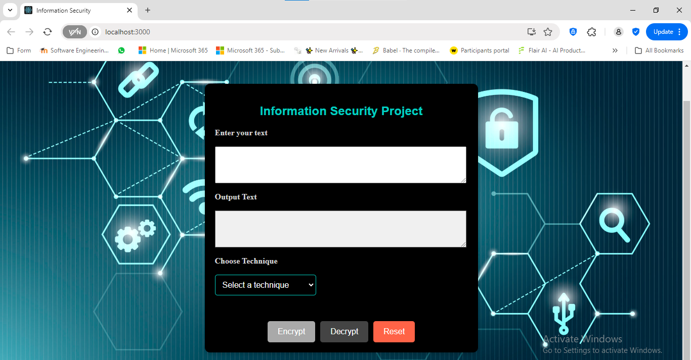
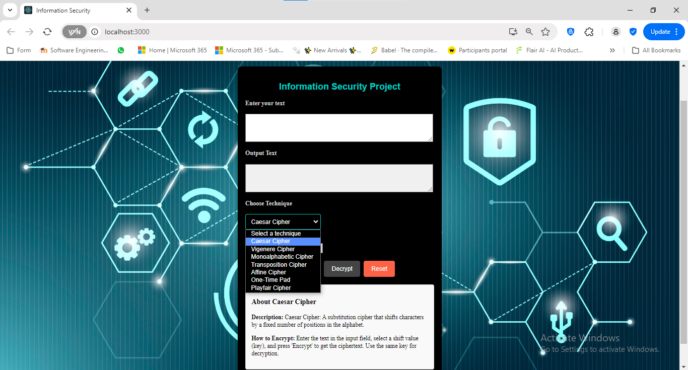
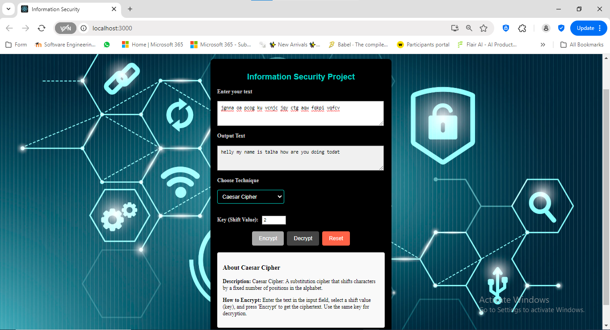

# Encrytion-Project.
# Information and security project.
Contributor's (**Muhammad Talha maasood**, [Sfwan Ali](https://github.com/Sfwanali13408))
This code is open source don't forget to give us credit

**how to use**
1. First clone the project on your system 
2. you will see two package Client(FrontEnd) and server(Backend)
3. Install both package dependencies by
 ```console 
 npm i
 ```
4. For Front-end type 
```console 
npm start
```  
5. For Backend 
```console 
node index.js
```
## Screenshots





